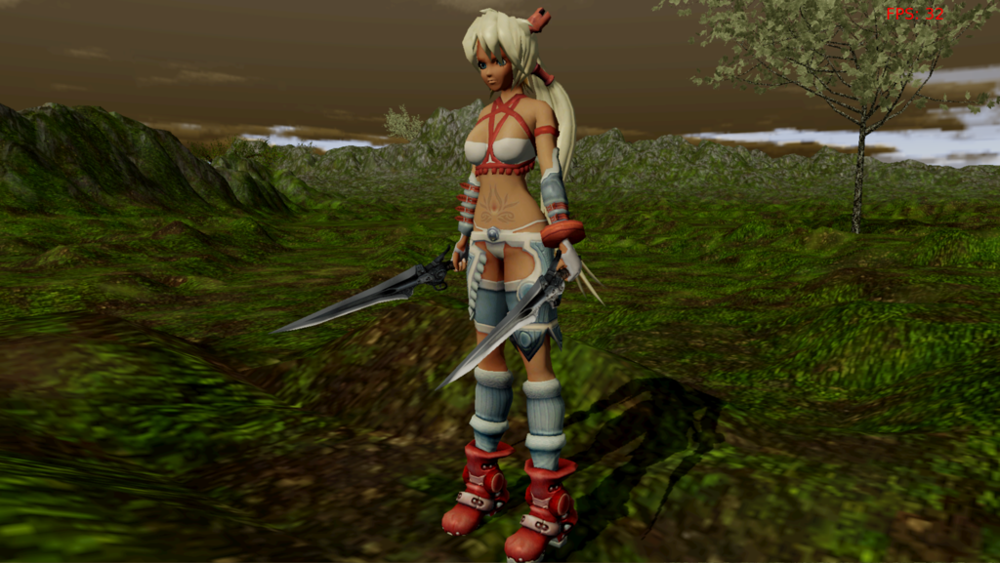

Land of Dreams
===

Simple attempt of drawing big terrains in OpenGL with CDLOD. The project also involves character animation with GPU skinning. It uses my c++ OpenGL wrapper: oglwrap. It aims Unix platforms (it doesn't use anything platform specific, but it only has build tools for Unix).

**This is just an educational project.** I don't own the rights for every media in the application.

Some screenshots (might not be up to date):



Dependencies:
-------------
* C++11 compiler.
* OpenGL 2.1, Shader model 120
* GLEW - for loading OpenGL extensions
* [oglwrap](https://github.com/Tomius/oglwrap) - my C++ OpenGL wrapper.
* GLFW3 - for window handling
* Magick++ - for image loading.
* Assimp - for loading the character in.


How to build (Debian/Ubuntu):
--------------------
```
mkdir LandOfDreams && cd LandOfDreams && sudo apt-get install libmagick++-dev libglew-dev && git clone https://github.com/assimp/assimp.git && cd assimp && cmake . && sudo make -j4 install && cd .. && git clone https://github.com/glfw/glfw.git && cd glfw && cmake . && sudo make -j4 install && git clone --recursive https://github.com/Tomius/LoD.git && cd LoD/src/engine/gui/freetype-gl && cmake . && make -j4 && cd ../../../.. && make -j4 && ./LoD
```

How to build (linux):
---------------------
* get the external dependencies: libmagick++-dev libglew-dev [assimp](https://github.com/assimp/assimp) [glfw](https://github.com/glfw/glfw)
* initialize the oglwrap submodule: git submodule init && git submodule update
* build freetype-gl (included): cd src/engine/gui/freetype-gl && cmake . && make
* build with make (uses clang++), run with ./LoD

Acknowledgements
================

- *Darkz* for useful feedback and help with the fixing of several bugs.
- *Kristóf Marussy (kris7t)* for a lot of useful advices and catching many implementation-dependent bugs.

----------------------
If you have any problem, please post in the issues tab or mail me at icyplusplus@gmail.com. Any feedback would be appreciated.
