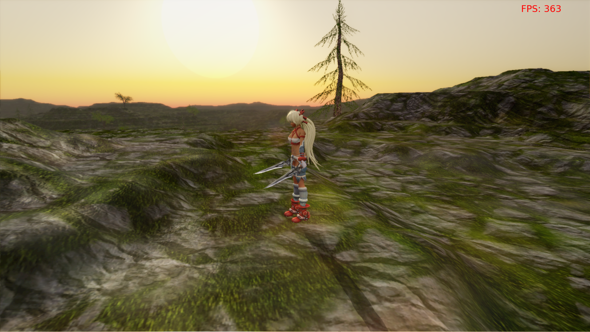

Land of Dreams
===

Simple attempt of drawing big terrains in OpenGL with the geomipmapping level of detail algorithm. The project also heavily involves character animation with GPU skinning. It uses my c++ OpenGL wrapper: oglwrap. 

**This is just an educational project.** I don't own the rights for every media in the application.

Here's a picture of the program's current capability (click on it, to see a short video):

Dependencies:
-------------
* C++11 compiler.
* OpenGL 3.1, Shader model 150, GLEW
* [oglwrap](https://github.com/Tomius/oglwrap) - my c++ OpenGL wrapper.
* SFML - for window handling
* Magick++ - for image loading.
* Assimp - for loading the character in. (An up-to-date copy of assimp is prefered, or else Ayumi might not get loaded correctly.)

How to build (linux):
--------------------
* Get [oglwrap](https://github.com/Tomius/oglwrap) and put it into include/
* Get the external dependencies: libsfml2-dev libmagick++-dev libglew-dev 
* Get a fresh copy of [assimp](https://github.com/assimp/assimp). (You'd better avoid the libassimp-dev package, it's kinda old).
* Use the given Makefile(it uses g++).

How to build (Windows):
----------------------
* Get [oglwrap](https://github.com/Tomius/oglwrap) and put it into include/
* Get the 3rd party libraries:
  * [GLEW](http://sourceforge.net/projects/glew/files/glew/1.10.0/) - The prebulilt one only works with MSVC, you probably need to build it yourself.
  * [SFML](http://www.sfml-dev.org/download/sfml/2.1/)
  * [Magick++](http://www.imagemagick.org/script/binary-releases.php) - Download the dynamic link Q16, install to compiler's path
  * [Assimp](http://sourceforge.net/projects/assimp/files/assimp-3.0/) - You need the SDK exe.
* Add the librarires to link:
  * glew32
  * opengl32
  * sfml-window
  * sfml-system
  * assimp
* Add ./include to search directories, or specify -Iinclude compiler flag.
* Add `Magick++-config --cppflags --cxxflags --ldflags` to compiler settings
* Add `Magick++-config --libs` to linker settings
* Enable c++11 mode with your compiler

Acknowledgements
================

- *Darkz* for useful feedback and help with the fixing of several bugs.
- *Kristóf Marussy (kris7t)* for a lot of useful advices and catching many implementation-dependent bugs.

License
=======

    DO WHAT THE FUCK YOU WANT TO PUBLIC LICENSE 
                    
    Copyright (C) 2013 Csala Tamás <tomius1994@gmail.com> 
         
    Everyone is permitted to copy and distribute verbatim or modified 
    copies of this license document, and changing it is allowed as long 
    as the name is changed. 
       
            DO WHAT THE FUCK YOU WANT TO PUBLIC LICENSE 
    TERMS AND CONDITIONS FOR COPYING, DISTRIBUTION AND MODIFICATION 
     
    0. You just DO WHAT THE FUCK YOU WANT TO.

----------------------
If you have any problem, please post in the issues tab or mail me at tomius1994@gmail.com. Any feedback would be appreciated.
